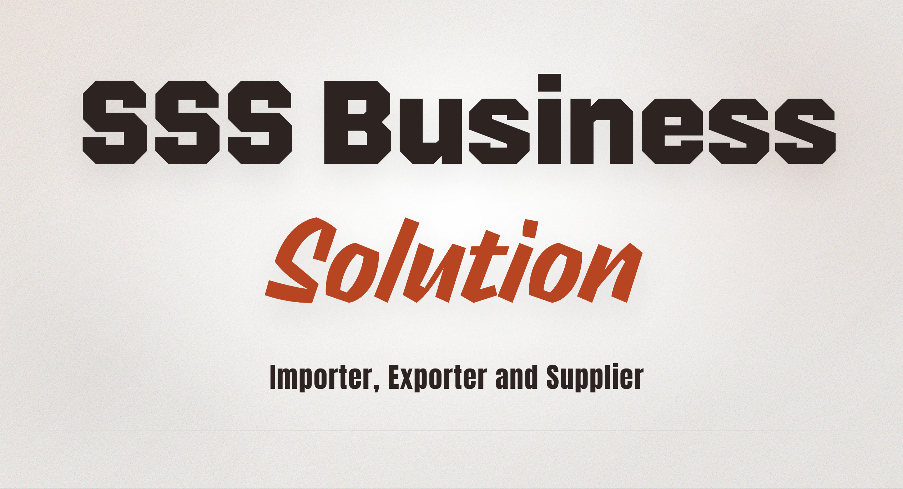
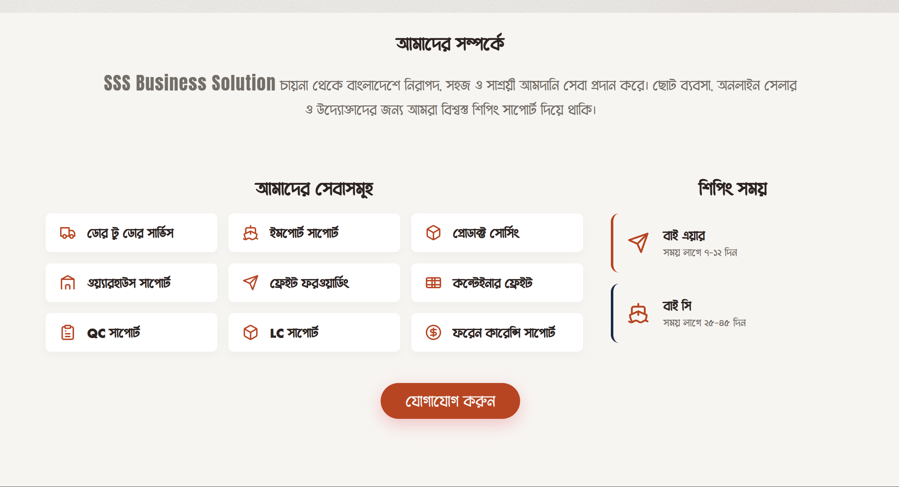
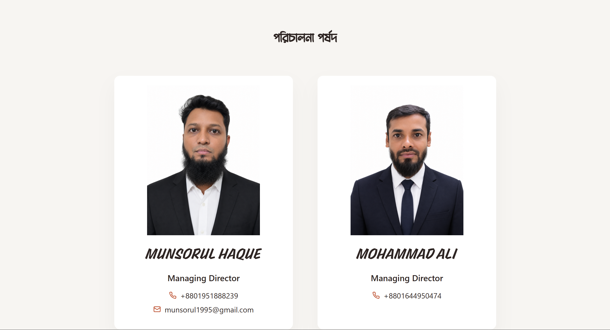
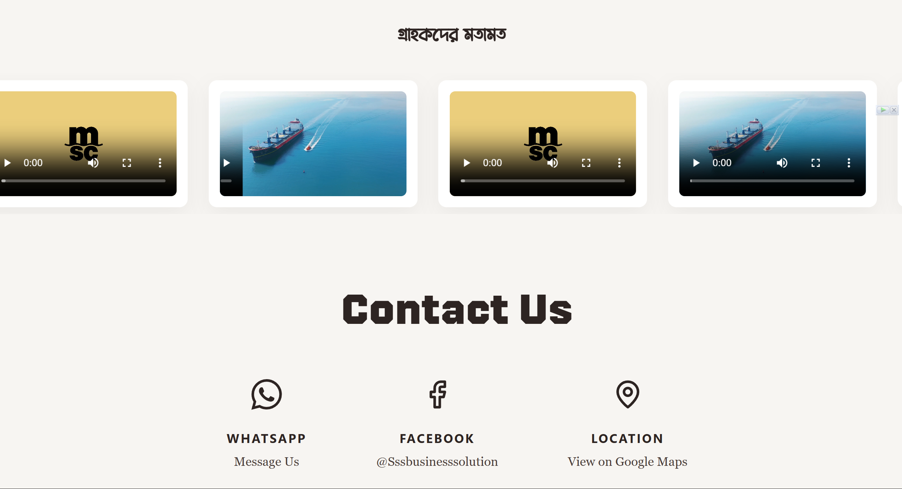
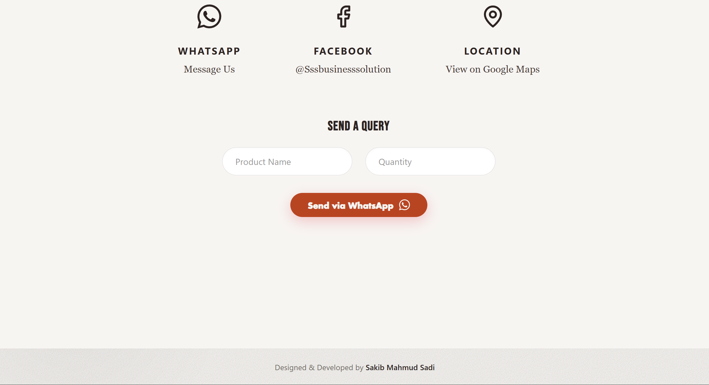
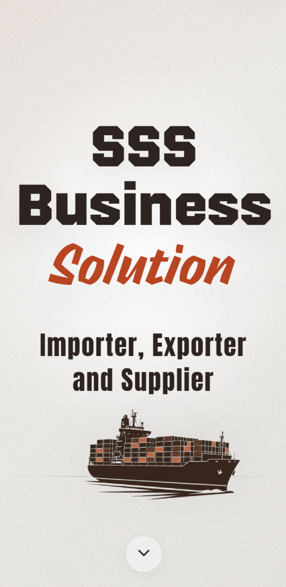
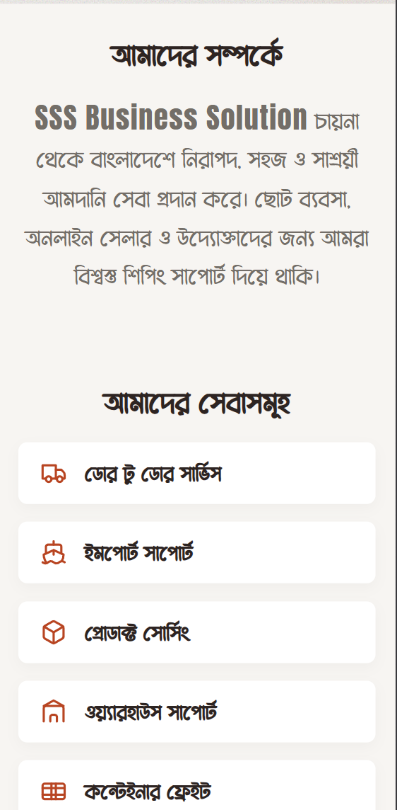
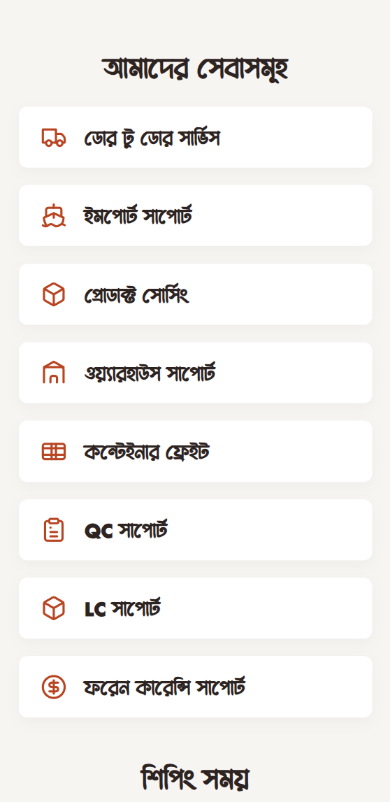
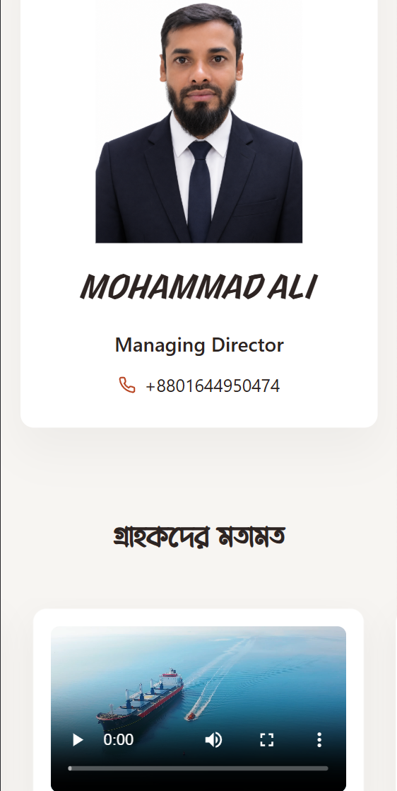
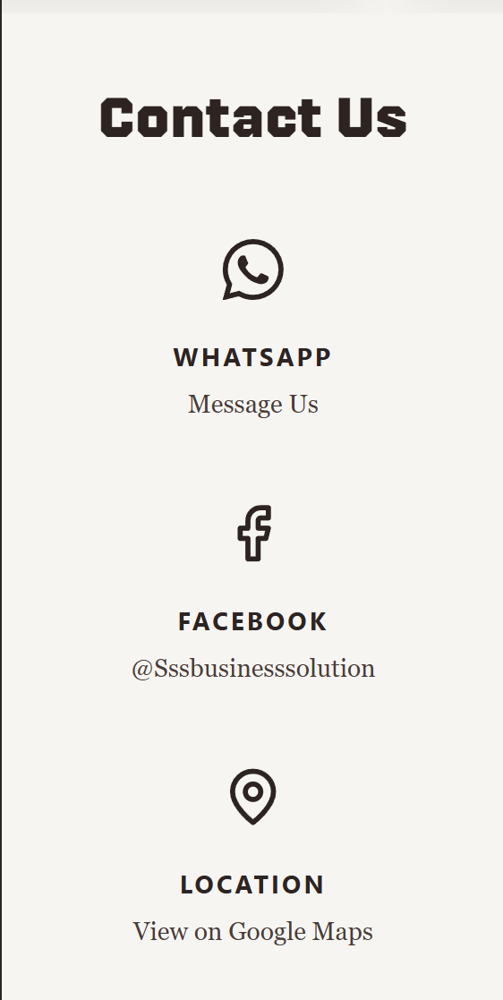

  <h1>
     SSS Business Solution
  </h1>
  

    <i>Built by <b>Sakib Mahmud Sadi</b> on August 2026</i>
  

 

## 🎬 Audio & Visuals

### Desktop Showcase

  <video src="https://github.com/user-attachments/assets/55bee065-83cf-4eec-ad14-9a2609f85b94" width="100%" controls></video>

 

  
  &nbsp;&nbsp;
  

  
  &nbsp;&nbsp;
  

  

 

### Mobile Showcase & Interface

  
  &nbsp;&nbsp;
  
  &nbsp;&nbsp;
  

  
  &nbsp;&nbsp;
  

  
  &nbsp;&nbsp;&nbsp;&nbsp;
  <video src="https://github.com/user-attachments/assets/b8f0a158-5672-467d-bf9b-7806ade6d91d" width="30%" controls></video>

---

  <b>Software & Frameworks</b>  
  
  
  
  

